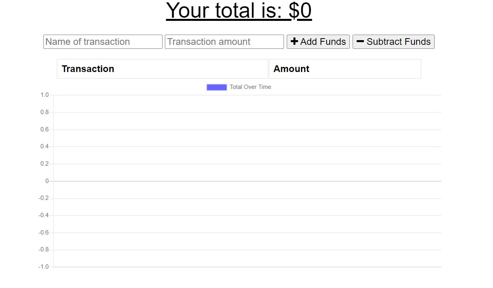
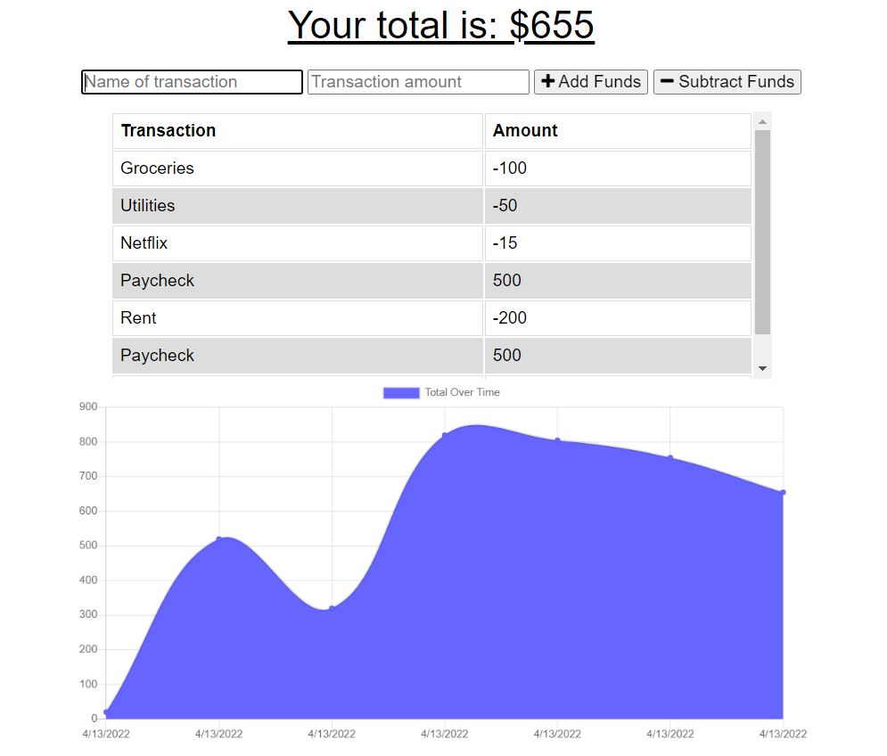

# PWA- Budget Tracker

## Table of Contents
[Description](#Description)    
[NPM Packages](#npm-packages)  
[Usage](#Usage)          
[Images](#Images)   
[Deployment](#deployment)

## Description
This application demonstrates how to add the necessary code to create a PWA, progressive web application. If the internet goes out, the user can still add/subtract to their budget and the information will be saved online when the internet is available.

## NPM Packages
- Express.js
- Mongoose
- Node.js
- Compression
- Morgan

## Usage
To use locally, run 'npm start' at your terminal from the project root. The application can be accessed via localhost:3001 in your browser.

The deployed application can be found on Heroku: https://ancient-meadow-60782.herokuapp.com/ 

## Images

When you open the app:

App with some budget information:
